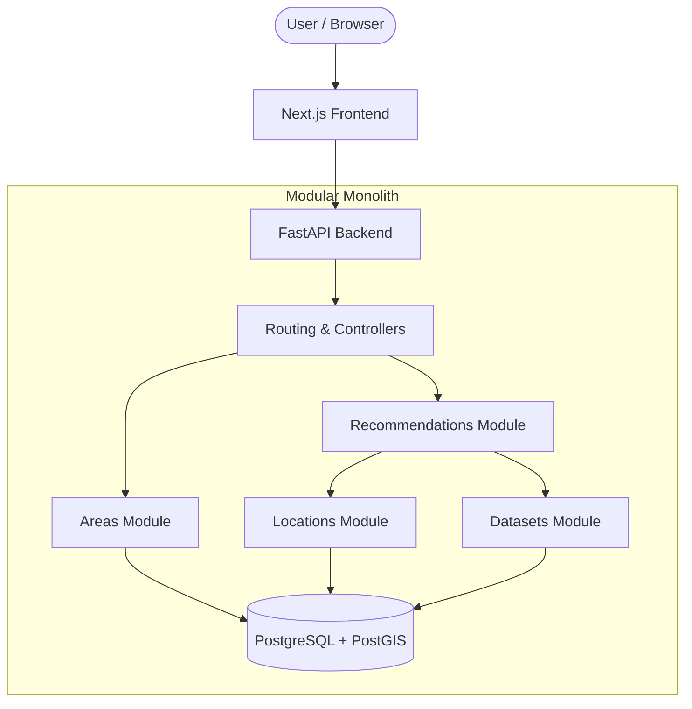

# Architecture

## System Context
blr.life is designed as a web-based platform allowing users to discover the best Bengaluru neighbourhoods to live in based on personal constraints and preferences. It relies on internal data and user inputs to produce ranked recommendations.

## Modular Monolith
The system is built as a **Modular Monolith**. This approach ensures low operational overhead and simplicity while enforcing strict boundaries between domains so they can be extracted later if necessary.

### Backend Domains
- `users` (stubbed for V1 - session/anonymous management)
- `areas` (neighbourhood entities and core metadata)
- `locations` (geospatial operations, distance calculations, routing heuristics)
- `datasets` (handling metrics, data imports, and normalizations)
- `recommendations` (scoring logic and explanation generation)

## Component Diagram

## Data Ingestion & Recommendation Boundary
- **Data Ingestion Boundary**: Offline scripts or admin APIs ingest geoJSON, OSM data, and custom datasets into the database. This boundary ensures bad data is caught before reaching production tables.
- **Recommendation Boundary**: The engine reads strictly from normalized metric tables in the DB. It does not perform live network calls to external APIs to score a neighbourhood, ensuring sub-second response times.

## Deployment Concept (V1)
For V1, a single Docker Compose environment containing:
1. `frontend` (Next.js Node server)
2. `backend` (FastAPI Uvicorn server)
3. `db` (PostgreSQL + PostGIS container)
This runs on a single VPS (e.g., DigitalOcean Droplet, AWS EC2, or Hetzner).

## Things we are intentionally NOT doing yet
- **Microservices**: Adds network overhead and complexity without resolving a real scaling need.
- **Kubernetes**: Unnecessary for a 3-container V1 deployment.
- **Event-Driven Architecture (everywhere)**: Synchronous REST calls are sufficient for V1.
- **Premature Redis Usage**: PostgreSQL can easily handle caching and state for V1 traffic via materialized views or simple tables.
- **Paid AI APIs**: V1 does not require an LLM to generate recommendations. Mathematical scoring is cheaper, faster, and explainable.

## Decision Record

| Decision | Chosen Approach | Reason | Alternatives Considered | When to Revisit |
|---|---|---|---|---|
| Architecture Style | Modular Monolith | Low operational overhead, easy to develop and debug, while keeping code clean. | Microservices | If a specific module (e.g., routing) requires massive independent scaling or separate technology. |
| Backend Framework | FastAPI (Python) | High performance, excellent Pydantic typing, strong ecosystem for data/ML later. | Express.js, Django, Spring Boot | Unlikely to revisit unless Python becomes a strict bottleneck. |
| Frontend Framework | Next.js (React) | Standard for modern web, good SEO capabilities, rapid UI development. | Vue, Svelte, Vanilla JS | Unlikely to revisit. |
| Database | PostgreSQL + PostGIS | Best-in-class open-source relational DB with unmatched geospatial capabilities. | MongoDB, MySQL, Neo4j | Unlikely to revisit. PostGIS is a hard requirement. |
| API Style | REST | Simple, predictable, easy to cache and test. | GraphQL, gRPC | When the frontend requires highly complex, nested, dynamic data fetching. |
| Recommendation | Deterministic Engine | Cheap to run, fast, 100% explainable, and testable. | LLM-based, Deep Learning | When sufficient usage data exists to train a learned-ranking model (LTR). |
| Map/Routing | MapLibre / Heuristics | Free, open-source, no API keys required. | Google Maps Platform | If exact traffic-aware routing becomes mandatory and users demand it. |
