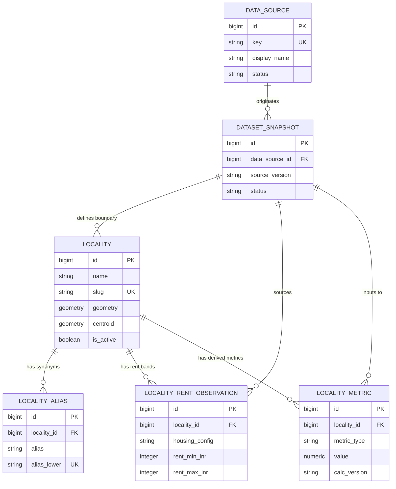

# Domain Model

This document outlines the core domain entities and relationships implemented in **blr.life** (Work Unit #4: Domain Schema & PostGIS Foundation).

---

## 1. Domain Entities

### `Locality`
The canonical geographical unit in Bengaluru (e.g. HSR Layout, Koramangala, Indiranagar).
- **Attributes**: `id` (BigInteger PK), `name` (String), `slug` (String Unique), `parent_zone` (String), `is_active` (Boolean), `geometry` (PostGIS MultiPolygon, SRID 4326), `centroid` (PostGIS Point, SRID 4326, NOT NULL), `geometry_source` (Enum), `geometry_confidence` (Enum), `external_source_id` (String), `geometry_snapshot_id` (FK -> DatasetSnapshot).
- **Responsibilities**: Represents neighbourhood boundaries, canonical identity, and point centroid for distance calculations.

### `LocalityAlias`
Search synonyms, abbreviations, and common misspellings for a locality.
- **Attributes**: `id` (BigInteger PK), `locality_id` (FK -> Locality, CASCADE), `alias` (String), `alias_lower` (String Unique).
- **Responsibilities**: Enables flexible, case-insensitive searching and normalization (e.g. "BTM" -> BTM Layout).

### `LocalityRentObservation`
Rent band observations for residential housing in a locality.
- **Attributes**: `id` (BigInteger PK), `locality_id` (FK -> Locality, CASCADE), `housing_config` (Enum: 1rk, 1bhk, 2bhk, 3bhk), `rent_min_inr` (Integer), `rent_max_inr` (Integer), `currency_code` (String), `observed_on` (DateTime), `snapshot_id` (FK -> DatasetSnapshot), `confidence` (Enum), `sample_size` (Integer), `notes` (Text), `is_current` (Boolean).
- **Responsibilities**: Stores coarse rent range bands per housing configuration.

### `LocalityMetric`
Precomputed derived locality-level metrics from offline data pipelines.
- **Attributes**: `id` (BigInteger PK), `locality_id` (FK -> Locality, CASCADE), `metric_type` (Enum: cafe_density, metro_distance_m, etc.), `value` (Numeric 12,4), `unit` (String), `calc_version` (String), `calculated_at` (DateTime), `snapshot_id` (FK -> DatasetSnapshot), `confidence` (Enum), `is_current` (Boolean).
- **Responsibilities**: Quantifiable scores and measurements used by the recommendation engine.

### `DataSource`
Origin registry for all imported external data.
- **Attributes**: `id` (BigInteger PK), `key` (String Unique), `display_name` (String), `source_url` (Text), `license_identifier` (String), `attribution_text` (Text), `notes` (Text), `status` (Enum: active, deprecated).
- **Responsibilities**: Legal, license, and provenance tracking for data sources.

### `DatasetSnapshot`
A concrete import run / snapshot version from a data source.
- **Attributes**: `id` (BigInteger PK), `data_source_id` (FK -> DataSource, RESTRICT), `source_version` (String), `retrieved_at` (DateTime), `content_checksum` (String), `status` (Enum: pending, completed, failed, partial), `is_current` (Boolean).
- **Responsibilities**: Versioning and audit trail for imported datasets.

---

## 2. Entity Relationship Diagram

---

## 3. PostGIS & Spatial Considerations

- `Locality.geometry` uses `GEOMETRY(MULTIPOLYGON, 4326)`.
- `Locality.centroid` uses `GEOMETRY(POINT, 4326)` and is `NOT NULL`.
- Both geometry columns are indexed with spatial **GIST** indexes (`ix_locality_geometry`, `ix_locality_centroid`).
