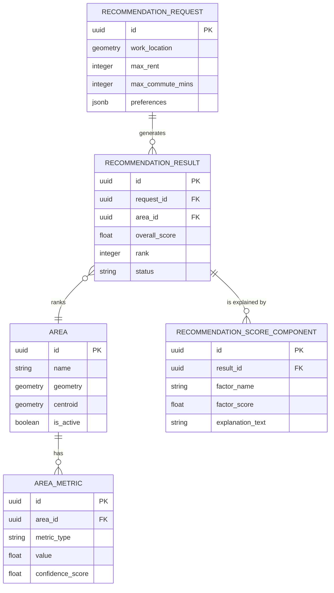

# Domain Model

## Conceptual Entities

### `Area` (Neighbourhood)
The core geographical unit (e.g., HSR Layout, Indiranagar).
- **Attributes**: `id`, `name`, `slug`, `geometry` (PostGIS Polygon), `centroid` (PostGIS Point), `is_active`.
- **Responsibilities**: Represents the boundaries and core identity of a neighbourhood.

### `AreaMetric`
Normalized data points associated with an area (e.g., average rent, cafe density).
- **Attributes**: `id`, `area_id`, `metric_type`, `value` (numeric), `confidence_score` (0.0 - 1.0), `updated_at`.
- **Responsibilities**: Stores quantifiable data that the recommendation engine can use for scoring.

### `Location` (POI / Workplace)
A specific point of interest, usually the user's workplace or a major transit hub.
- **Attributes**: `id`, `name`, `coordinates` (PostGIS Point), `type` (e.g., office, metro_station).

### `RecommendationRequest`
The inputs provided by the user.
- **Attributes**: `id`, `work_location` (Point), `max_rent`, `min_bhk`, `max_commute_mins`, `preferences` (JSON/Dictionary of weightings), `created_at`.
- **Lifecycle**: Created when a user submits a search. Often anonymous in V1.

### `RecommendationResult`
The output of the engine for a specific request and area.
- **Attributes**: `id`, `request_id`, `area_id`, `overall_score`, `commute_estimate_mins`, `rent_estimate`, `rank`.

### `RecommendationScoreComponent`
The breakdown of *why* an area received its score (Explainability).
- **Attributes**: `result_id`, `factor_name` (e.g., "Commute", "Nightlife"), `factor_score`, `explanation_text` (e.g., "Excellent metro access boosts connectivity.").

## Entity Relationship Diagram

## PostGIS Considerations
- Use `GEOMETRY(Polygon, 4326)` for `Area.geometry` to store boundaries.
- Use `GEOGRAPHY(Point, 4326)` for distances (e.g., workplace to area centroid) to accurately calculate meters over the earth's surface.
- Spatial indexes (GIST) must be applied to all geometry/geography columns.
